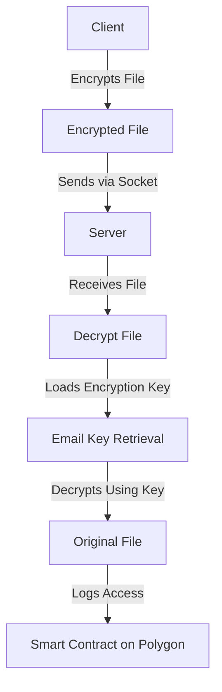

# Secure File Transfer with Smart Contract Logging

This project ensures secure file transfer using encryption and logs access via a smart contract deployed on the **Polygon blockchain**.

## Features
- **End-to-End Encryption** using `Fernet` (AES-based symmetric encryption).
- **Secure Key Exchange** via email.
- **File Transfer** using Python Sockets.
- **Blockchain Logging** to track file access.

## Project Architecture


## How It Works
1. **Client Side**:
   - Encrypts the plaintext file.
   - Sends the encryption key via email.
   - Transfers the encrypted file to the server.

2. **Server Side**:
   - Retrieves the encryption key from email.
   - Receives and decrypts the file.
   - Logs access in a smart contract.

3. **Smart Contract Logging**:
   - The server calls a Polygon smart contract to record file access.
   - Each log entry includes the **timestamp, sender, receiver, and filename**.

## Installation & Setup
### Prerequisites
- **Python 3.8+**
- **pip**
- **Metamask (for testing smart contract)**
- **Polygon RPC Endpoint** (from Alchemy or Infura)

### Install Dependencies
```sh
pip install web3 cryptography tqdm yagmail
```

### Deploy Smart Contract on Polygon
1. Write a Solidity smart contract to **log file access**.
2. Deploy it using Remix IDE.
3. Copy the **contract address** for integration.

### Run the Project
#### Start the Server
```sh
python server.py
```
#### Run the Client
```sh
python client.py
```

## Smart Contract Integration
- The server interacts with the Polygon smart contract using Web3.py.
- Every successful file transfer logs data on-chain.

## Future Enhancements
- Implement **Decentralized Storage (IPFS/Filecoin)** for storing files.
- Use **Zero-Knowledge Proofs** to verify access without exposing data.

---
**Author:** Shrujan Kharwadey

